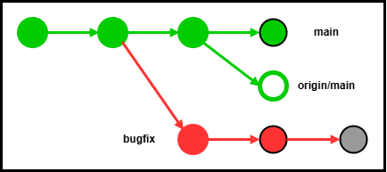
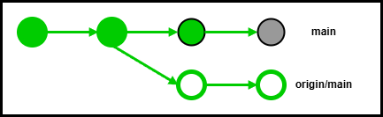

# proconでのリポジトリの使い方
## 目次
- [フォルダ構成](#フォルダ構成)
- [コーディング時の注意](#コーディング時の注意)
- [名前の定義ルール](#名前の定義ルール)
- [基本的なクラス設計](#基本的なクラス設計)
- pass

<a id="フォルダ構成"></a>
<details>
<summary><span style="font-size:1.5em; font-weight:bold;">フォルダ構成</span></summary>

---
```
repository
├── .github
│   └── workflows
|       ├── test.yml    # pull request時にtesterを実行し、コメント
|       ├── linter.yml  # pull request時にリンターを実行し、コメント
│       └── doxygen.yml # ライブラリの設計仕様をpagesにデプロイ
├── .vscode
│   ├── extensions.json # 推奨拡張機能のリスト
│   └── c_cpp_properties.json   # コンパイラ設定ファイル
│
├── library             # すべてのライブラリのフォルダ 
│   └── LIBRARY_DESIGN.md       # ライブラリの設計仕様 
├── solve               # 問題のsolveファイルのフォルダ
│   ├── solve.cpp       # solveファイル
│   ├── util.hpp        # soleファイルの補助ライブラリ
│   └── parameters.hpp  # パラメータファイル
├── input               # inputデータのフォルダ
├── output              # outputデータのフォルダ
├── server              # サーバーやpc間の連携を行うフォルダ
├── visualizer          # 回答データや分析結果の可視化
│   └── analysis        # 回答データを分析したデータのフォルダ
├── tester              # 関数やクラスの実行テストフォルダ
│   └── testAll.py      # すべてのテストを行うファイル
├── diagrams            # 設計図のフォルダ
│   └── design.drawio   # ライブラリやワークフローの設計図
├── images              # Readmeに記す画像のフォルダ
│
│
├── .gitignore          # リポジトリに含めないファイルの設定
├── Doxyfile            # doxygenの設定ファイル
├── Makefile            # リンカコンパイルの設定ファイル
├── run.sh              # すべてのコマンド操作を行うファイル
├── COMMAND.md          # run.shなどのコマンドの解説
├── CONTRIBUTING.md     # 共同開発者にリポジトリのルールの解説
└── README.md           # リポジトリの説明（使い方など）
```

>### `doxygen.yml`ファイル
> libraryフォルダで定義したクラスや関数を **`doxygen`** でドキュメンテーション化し、
> プッシュ時にdoxygen.ymlファイルで **`github pages`** に自動デプロイする。<br>
>
> github pagesのリンクは[こちら](https://google.com)

>### `library`フォルダ
> ドキュメンテーションコメントを書く。**`（処理の説明ではなく、使い方の説明）`**<br>
> solveで使用するc++のクラスや関数をまとめる。<br>
> 関数には **`inline`** をつけてリンクできるようにする<br>
> serverやvisualizerのpythonライブラリを作る場合は **`library / pythonフォルダ内`** に置く。<br>
> ライブラリを作成する前にLIBRARY_DESIN.mdに設計仕様をまとめ、
> 計画的にクラスを作成する。 **`（他の人と相談しながらがいい）`**<br>
> umbrella headerを作成し、一括includeできるようにする。<br>
> #pragma onceを用いて **`インクルードガード`** する。
>
>---
> #### ライブラリ作成の注意
> 名前は長くていいから絶対に **`今後被らないような名前`** にする。（名前の定義ルールは[こちら](#名前の定義ルール)）<br>
> ライブラリファイルは **`基本変更しない`** ような設計にする。（パラメータ値はsolveフォルダ内に書きincludeする）<br>
> 例外処理か、エラー出力を行う。エラー出力では内部データを出力し、**`デバックしやすくする`**。<br>
> 右辺値や左辺値、constを意識して **`無駄なコピー`** が発生しないようなクラスにする。<br>
> 役割ごとに **`namespace`** を分割し、一つのファイルに多くのクラスや関数を定義しない。<br>
> クラス内に構造体が必要になったら **`クラス内に書く`** 。<br>
> クラス内のメンバ変数はpublicにせず、getterやsetterでやり取りする。<br>
> 同じ関数でも引数を変えてオーバーライドし、様々な状況で使いやすくする。<br>
> templateを用いて柔軟なクラスにする。（競技のデータ構造による）<br>
> conceptやrequiresを用いて **`templateの型を制限する`**。<br>
> コンストラクタには基本explicitをつけ、暗黙の型変換を防止する。<br>
> コンパイル時に計算できる可能性のある関数は基本contexprをつける<br>
>
> クラスの基本的な設計は[こちら](#基本的なクラス設計)

>### `solve`フォルダ
> 大まかな解法ごとにフォルダをネストさせる。<br>
> 処理ごとにutil.hppでファイルを分け、includeする。（ライブラリフォルダではなくsolveフォルダに入れる）<br>
> 似た解法のsolve.cppを作るときは同じutil.hppをincludeして共通の処理を一つのファイルで管理<br>
> 処理ごとに関数に分け、関数の役割を分散する。<br>
> パラメータはsolveファイルに書かず、hppに分け、定数値として定義する。


>### `server`フォルダ
> 大会サーバーやpc間の通信処理はここで行う。<br>
> guiのボタンで簡単に操作できるようにする。

>### `visualizer`フォルダ
> 回答データや分析データをguiで可視化する。<br>
> run.shと被るが、solveを実行しそれぞれの入力例を入力できるようにすると便利

>### `tester`フォルダ
> コンパイルできるか、関数やクラスが適切な値を返すか、短時間で確認できるテストを試す。<br>
> テスト方法は要検討

>### `analysis`フォルダ
> 回答データを分析し、推移や解法ごとの分析データを保存する<br>
> 状態変化をgifとして保存するのもあり

>### `run.sh`ファイル
> ファイルのコンパイルや実行などターミナルで実行するコマンド処理は全てこれで行う。（gitコマンドは除く）<br>
> makefileでオブジェクトファイルの作成やリンクもこれで行う。

</details>

---

<a id="コーディング時の注意"></a>
<details>
<summary><span style="font-size:1.5em; font-weight:bold;">コーディング時の注意</span></summary>

---
- [名前の定義ルール](#名前の定義ルール)を守る。変数や関数などの名前は絶対に日本語にしない！！
- あやふやな名前、被りそうな名前は使わない、長くてもいいから誰でも意味が分かる名前にする。
- 一時的な変数は以下のように書き、延命を防ぐ。
```c++
int main(){
    int n = 1;
    {
        int tmp = n * 2;
        cout << tmp << endl;
    }
}
```
- {}内の処理が長くなる場合は以下のように最後にコメントを書く。
```c++
namespace test{
    // ...処理...
}//namespace test
```
- コメントを書く。
- 頻繁にコミットする。
- 処理を追加するときはブランチを切る。
- testerをちゃんと作る
- [フォルダ構成](#フォルダ構成)に書かれたファイル名を厳守する必要はない、役割に合わせて柔軟に変更。

</details>

---

<a id="名前の定義ルール"></a>
<details>
<summary><span style="font-size:1.5em; font-weight:bold;">名前の定義ルール</span></summary>

---
> ### 一般的な命名規則として５つに分類される。
> 1. パスカルケース（MyName）
> 2. キャメルケース（myName）
> 3. スクリーミングケース（MY_NAME）
> 4. スネークケース（my_name）
> 5. ケバブケース（my-name）

> ### 種類別の命名規則
> | 種類 | 命名規則 |
> | --- | --- |
> | 型 | パスカルケース（MyName） |
> | ファイル、フォルダ | スネークケース（my_name） |
> | クラス | パスカルケース（MyName） |
> | 関数、メソッド | スネークケース（my_name） |
> | 変数 | スネークケース（my_name） |
> | 定数 | スクリーミングケース（MY_NAME） |
> | 真偽値（bool）| is_my_name |

</details>

---

<a id="基本的なクラス設計"></a>
<details>
<summary><span style="font-size:1.5em; font-weight:bold;">基本的なクラス設計</span></summary>

---
```c++
template <typename T>
concept Addable = requires(T a, T b){
    {a + b};
}

template <Addable T>
class MyClass{
    protected:
        // メンバ変数や定数
        string name;
        vector<T> vec_data;

    public:
        //コンストラクタ
        explicit MyClass();
        explicit MyClass(const MyClass& other);
        explicit MyClass(MyClass&& other) noexcept;

        //デストラクタ
        virtual ~MyClass();

        //アクセサ
        string get_name() const;
        void set_name(string other_name);

        //イテレータ
        typename vector<T>::iterator begin();
        typename vector<T>::iterator end();
        typename vector<T>::const_iterator begin() const;
        typename vector<T>::const_iterator end() const;

        //演算子
        MyClass& operator=(const MyClass& other);
        MyClass& operator=(MyClass&& other) noexcept;
        auto operator<=>(const MyClass& other) const;
        auto operator==(const MyClass& other) const;
        vector<T>& operator[](size_t index);
        const vector<T>& operator[](size_t index) const;

        //コンバータ
        explicit operator bool() const;

        //出力
        void print(ostream& os = cout) const;

    private:
        //クラス構築
        void build(const vector<T>& data);
        void build(vector<T>&& data);

}
```

> クラスがvectorに似た挙動をするならvectorに使われている関数をあらかた実装する。<br>
> 標準ライブラリのリファレンスは[こちら](https://cpprefjp.github.io/reference.html)

</details>

---

<a id="gitの使い方"></a>
<details>
<summary><span style="font-size:1.5em; font-weight:bold;">gitの使い方</span></summary>

---
commitメッセージは日本語で分かりやすく書く。（長くてもいい）<br>
複数の人が同じブランチを編集している状態は避ける。<br>
マージしたあとはブランチを削除する。（ブランチの履歴は消えない）<br>
stashするときはすべてのファイルを保存する。<br>
stashはいくつも作れるが、基本一つにする。<br>
pushしたコミットはrebase、resetしない<br>
pushしたタグは消してはいけない<br>
mainにmergeはせずにpull requestを送る。ymlが自動判定するから成功したら自分でpull requestを許可する。<br>
pull requestはgithubのサービスであるため、ターミナルでは実行できない。pull requestだけvscodeのuiを使う。<br>
コマンド実行時に途中で衝突したら実行が止まるため、--continueで再開<br>
コマンドを途中で中断するときは、--abort

> ### gitコマンド一覧
> 共同開発で使うものだけを一覧にしたため、他のコマンドは使わないと思う。<br>
> より多くのgitコマンドは[こちら](https://zenn.dev/zmb/articles/054ba4189244a5) 
> git用語は[こちら](https://qiita.com/shinshingodmt/items/637cf9e5c6660509c460)
>
> | コマンド | 効果 |
> | --- | --- |
> | git status | 現在の状態を表示 |
> | | |
> | git add (ファイル名) | (ファイル名)をステージングする |
> | git add . | すべてのファイルをステージングする |
> | git commit -m (コミットメッセージ) | ステージングファイルをコミットする |
> | git commit --amend -m (コミットメッセージ) | 直前のコミットメッセージを変更（ステージング状態は空にしておく） |
> | git merge (ブランチ名) | (ブランチ名)を現在のブランチにマージ（mainにはpull requestする）|
> | | |
> | git push | 現在のブランチのローカルの変更内容をリモートに送信 |
> | git push origin (ブランチ名) | (ブランチ名)のローカルの変更内容をリモートに送信 |
> | git push -u origin (ブランチ名) | リモートに(ブランチ名)を追加してpushする |
> | git pull | 現在のブランチのリモートの変更内容をローカルに取り込む |
> | git pull origin (ブランチ名) | (ブランチ名)のリモートの変更内容をローカルに取り込む |
> | git pull --rebase | 自分のcommitを他人のcommitの後に変える |
> | git fetch --all | ローカルを最新の状態に更新（ローカルリポジトリは変更しない）|
> |  |  |
> | git branch | ブランチの一覧を表示 |
> | git branch -m (現在のブランチ名) (新規ブランチ名) | ブランチ名の変更 |
> | git branch -d (ブランチ名) | (ブランチ名)を削除 |
> | git branch -D (ブランチ名) | マージしてない(ブランチ名)を削除（超危険）|
> | git checkout (ブランチ名) | (ブランチ名)に切り替え |
> | git checkout (コミット値) | (コミット値)に切り替え |
> | git checkout -b (ブランチ名) | (ブランチ名)のブランチを作成 |
> |  |  |
> | git stash | 編集した内容を退避 |
> | git stash list | stashの一覧を表示（stashの番号はこれで確認）|
> | git stash show stash@{(番号)} | (番号)番目のstashを詳細表示 |
> | git stash save (コメント) | stashに(コメント)をつけてstashする |
> | git stash pop | 編集した内容を呼び出す |
> | git stash pop stash@{(番号)} | (番号)番目のstashでpopする |
> | git stash drop stash@{(番号)} | (番号)番目のstashを削除（超危険） |
> |  |  |
> | git rebase (ブランチ名) | (ブランチ名)にrebaseする |
> | git rebase --continue | rebaseの再開 |
> | git cherry-pick (コミット値) | (コミット値)を取り込む |
> | git cherry-pick (コミット値1)..(コミット値2) | (コミット値1)の次から(コミット値2)を順にcherry-pick |
> | git cherry-pick --continue | cherry-pickの再開 |
> |  |  |
> | git revert HEAD | 直前のコミットを打ち消すコミットを追加 |
> | git revert (コミット値) | (コミット値)のコミットを打ち消すコミットを追加 |
> | git restore (ファイル名) | (ファイル名)で編集した内容を破棄（超危険） |
> | git restore . | すべてのファイルで編集した内容を破棄（超危険） |
> |  |  |
> | git reflog | git操作の状態履歴を表示 |
> | git reset --soft HEAD~(個数) | 直近(個数)個のコミットをステージング状態に戻す（危険） |
> | git reset --soft HEAD^ | 直近１個のコミットをステージング状態に戻す。（危険）|
> | git reset --hard HEAD@{(番号)} | リポジトリを(番号)番目の状態に戻す（超危険） |
> |  |  |
> | git tag | タグの一覧を表示 |
> | git tag -a (タグ名) -m "(タグのコメント)" | 直近のコミットにタグを付ける |
> | git tag -a (タグ名) -m "(タグのコメント)" (コミット値) | (コミット値)にタグを付ける |
> | git tag -d (タグ名) | タグを削除 |

</details>

---

<a id="ターミナルでgithubにログイン"></a>
<details>
<summary><span style="font-size:1.5em; font-weight:bold;">ターミナルでgithubにログイン</span></summary>

---
### 1. linuxターミナルで以下を実行する
```bash
sudo apt update
sudo apt install gh -y
gh auth login
```

### 2. ４つの項目を聞かれるので以下を選択
```txt
what account do you want to log into?
> GitHub.com

what is your preferred protocol for Git operations?
> HTTPS

Authenticate Git with your GitHub credentials?
> y

How would you like to authenticate GitHub CLI?
> Login with a web browser
```

### 3. git pushを行えたら成功

</details>

---

<a id="githubの使い方"></a>
<details>
<summary><span style="font-size:1.5em; font-weight:bold;">githubの使い方</span></summary>

---
基本的な使い方は[こちら](https://qiita.com/ham0215/items/15cbbbc9328e52cc2aa2)のすべての章

</details>

---

<a id="開発フロー"></a>
<details>
<summary><span style="font-size:1.5em; font-weight:bold;">開発フロー</span></summary>

---
git用語は[こちら](https://qiita.com/shinshingodmt/items/637cf9e5c6660509c460)<br>
mainブランチを更新したらすぐpushする。<br>
基本的に開発時のメモは[discussionやwiki](#githubの使い方)を使う。<br>
mainにマージする前にコード整理を行いみんなが見やすい形にする。<br>
一旦の数値等の一時的なメモはmemo.txtに書く。（リポジトリには含まれないため、ブランチを変えても変更されない）

> ### 図の説明
> 
> 
> - リモートのコミットは枠線
> - ローカルのコミットは塗りつぶし
> - 塗り潰し、枠線の色でブランチの違い
> - ステージング、ステージング前の一時的な変更は灰色

> ### リモートとローカルの違い
> ローカルで編集しただけでは、リモートには反映されないため、pushする必要がある。<br>
> 共同者も同時に編集するため、リモートは常に更新される。<br>
> ローカルの編集とリモートの編集が衝突しないよう、リモートにpushする前に必ずfetchを行う。<br>
> なにかリモートに変更を加えるときは、最新のリモートの状態を把握する。<br>
> ローカルで大量の編集を貯めず、頻繁にリモートにpushする。<br>
> この章では様々な状況に対する対処を共有する。

> ### stashの使い方
> stashコマンドの一覧は[こちら](#gitの使い方)<br>
> 自分のブランチで修正している時に別のブランチを編集したいとき、
> stashコマンドを用いることでステージング、ステージング前の変更がすべて保存される。<br>
> 保存した変更を別のブランチで展開することもできるが、なるべく使用を避ける。

> ### 同じブランチで共同者がコミットしていた時の対処（rebase）
> 下図のようにローカルで編集した内容をpushする際に、リモートで共同者がコミットしていたとき、そのままpushすることはできない。<br>
> このとき、rebaseを行い自分の変更をリモートブランチの後ろにコミットし直す。
> 
> 
> 
> 1. ローカルで行った編集をコミットする。（stashで後から復元すると衝突処理がめんどい）
> 2. git rebase origin/(ブランチ名)でリモートブランチにリベースする。
> 3. 途中で衝突が発生した場合、修正を行いステージング状態にする。（絶対にコミットしない）
> 4. 衝突処理が完了したらgit rebase --continueでリベースを再開する
>
> 上の手順を行うことで下図の状態となる。（一時的な編集はコミットしない場合）<br>
> 複数人で同じブランチを直接編集することは避ける。
>
> 


<!-- 同じブランチで他の人がコミットしていた時の対処（rebase） -->
<!-- mainブランチで行ったバグ修正のみを取り込む（cherry-pick） -->
<!-- 別のブランチからmainにpull requestする -->
<!-- pull requestが完了した後にマージを取り消す -->
<!-- 別のブランチの編集時にmainブランチでバグや改善を発見した場合 -->

</details>

---

<a id="branch名の定義ルール"></a>
<details>
<summary><span style="font-size:1.5em; font-weight:bold;">branch名の定義ルール</span></summary>

---
> ### ブランチの命名規則
> ブランチ名には'/'をつけることができる。<br>
> ブランチ名の前にそのブランチの種類を書く（例：bugfix/library）
> 
> | 種類 | 命名規則 |
> | --- | --- |
> | 機能追加 | feature |
> | バグ修正 | bugfix |
> | コード整理 | refactor |
> | テストコード | test |
> | ドキュメント整理 | docs |
>
> バグの修正でissueを修正する場合は **`bugfix/issue-(issueの番号)`** にする。

</details>

---

<a id="環境構築"></a>
<details>
<summary><span style="font-size:1.5em; font-weight:bold;">環境構築</span></summary>

---
<!-- githubのログインはここに入れる -->

</details>

---

<a id="pull requestの方法"></a>
<details>
<summary><span style="font-size:1.5em; font-weight:bold;">pull requestの方法</span></summary>

---
<!-- 基本draft pull requestする -->

</details>

---

<a id="issueの使い方"></a>
<details>
<summary><span style="font-size:1.5em; font-weight:bold;">issueの使い方</span></summary>

---


</details>

---

<a id="リポジトリ設定"></a>
<details>
<summary><span style="font-size:1.5em; font-weight:bold;">リポジトリ設定</span></summary>

---

</details>

---

<a id="test"></a>
<details>
<summary><span style="font-size:1.5em; font-weight:bold;">test</span></summary>

---


</details>

---